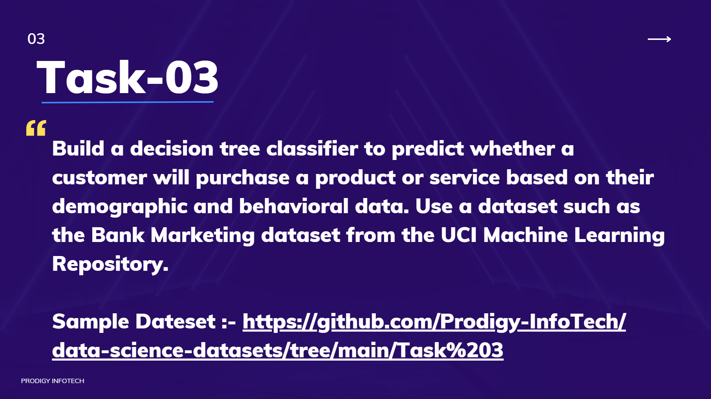

# PRODIGY_DS_03
## Prodigy Infotech – Data Science Internship (Task 3)

Hi there!  
I'm **RITHIK CA**, and this repository contains my submission for **Task 3** of the **Prodigy Infotech Data Science Internship**. In this task, I built and evaluated decision tree classifiers to predict whether a customer will subscribe to a bank term deposit, based on demographic and behavioral data from a real-world bank marketing dataset.  

---

## 📋 Problem Statement
The objective is to create a predictive model that accurately identifies which clients are likely to subscribe to a bank term deposit, using features from direct marketing campaigns carried out by a Portuguese banking institution.  

---

## 🌍 About the Dataset
This project uses the **Bank Marketing Dataset** from the UCI Machine Learning Repository:  

- **Source:** [UCI Repository - Bank Marketing Dataset](https://archive.ics.uci.edu/ml/datasets/bank+marketing)  
- **Observations:** 45,211 client records  
- **Key Features:**
  - `age`, `job`, `marital`, `education`
  - `default`, `balance`, `housing`, `loan`
  - `contact`, `day`, `month`, `duration`, `campaign`, `pdays`, `previous`, `poutcome`
- **Target:** `y` (subscription: yes/no)

---

## 🛠 Tools & Libraries
- Python (Jupyter Notebook)  
- `pandas` & `numpy` for data wrangling  
- `matplotlib` & `seaborn` for visualization  
- `scikit-learn` for machine learning models  

---

## 🔍 Workflow Overview

### 1. Data Exploration
- Loaded and reviewed the dataset structure.  
- Summarized key statistics and checked class balance.  
- Explored feature-target relationships using visualizations.  

### 2. Data Cleaning & Preprocessing
- Handled missing and ambiguous values.  
- Encoded categorical features using label encoding and one-hot encoding.  
- Standardized feature formats for modeling.  

### 3. Feature Engineering
- Selected relevant features based on domain knowledge and correlation analysis.  
- Created composite features where applicable.  

### 4. Model Training & Evaluation
- Built decision tree classifiers with **Entropy** and **Gini** criteria.  
- Tested models with and without depth limitations.  
- Evaluated using accuracy, balanced accuracy, precision, and recall, with emphasis on minority class.  

### 5. Visualization
- Created bar plots, count plots, and heatmaps for trends and class distributions.  
- Visualized decision tree structures for interpretability.  

---

## 💡 Key Takeaways
- **Class imbalance:** Dataset skewed toward non-subscription, affecting minority-class prediction.  
- **Important features:** `previous outcome`, `duration`, `contact type` strongly influence subscription likelihood.  
- **Model depth:** Shallow trees improve interpretability; deeper trees slightly improve raw accuracy but risk overfitting.  
- **Future improvement:** Apply class balancing techniques like SMOTE or class weighting to improve minority-class predictions.  

---

## 📊 Model Performance Summary

| Model                 | Accuracy | Balanced Accuracy | Precision (Subscribed) | Recall (Subscribed) |
|-----------------------|----------|-----------------|-----------------------|-------------------|
| Entropy, no max depth | 0.89     | 0.60            | 0.67                  | 0.53              |
| Gini, no max depth    | 0.90     | 0.62            | 0.71                  | 0.54              |
| Entropy, max depth=3  | 0.87     | 0.65            | 0.74                  | 0.62              |
| Gini, max depth=3     | 0.88     | 0.67            | 0.76                  | 0.65              |

*Note: Please refer to your project output for final metric values.*  

---

## 🎯 Conclusion
This project demonstrates the **full data science workflow**: from cleaning and exploring real-world data, through feature selection and engineering, to building, evaluating, and interpreting machine learning models for a practical business problem. Handling imbalanced classes and extracting actionable insights are key challenges for prediction-driven marketing.  

**Thank you for visiting!** 😊  
For questions or feedback, feel free to open an issue or reach out.  

---

🔗 **GitHub Repository:** 
